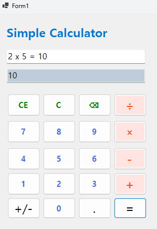
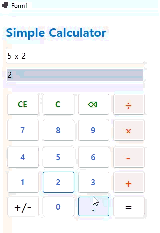
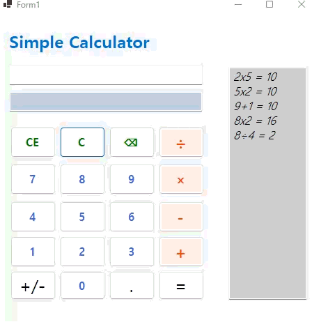
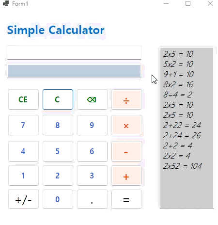

## 개요

- C# 프로그래밍 학습

- 1줄 소개: 사칙연산을 수행하는 계산기 프로그램

- 사용한 플랫폼:
    - C#, .NET Windows Forms, Visual Studio, GitHub
- 사용한 컨트롤:
    - Label, TextBox, Button

-사용한 기술과 구현한 기능:
    - string 데이터를 int로 변환하여 계산 수행하기
    - string 데이터를 double로 변환하여 계산 수행하기
    - result 변수를 이용하여 계산 결과 저장하기
    - keyboard 이벤트를 이용하여 키보드 입력으로 계산 수행하기

## 실행 화면 (과제1)
- 과제1 코드의 실행 스크린샷

- 과제 내용
    - TextBox(입력표시, 결과표시), Button(계산) 등을 적절히 배치하여 Ui를 구성하기
    - 숫자 Button 클릭 시 TextBox에 표시합니다. 2가지 방법으로 표시
    - 사칙연산 계산 기능
    - 계산결과를 텍스트박스에 출력하기

- 구현 내용과 기능 설명
    - 버튼을 누르면 TextBox에 해당 숫자를 표시한다.
    - 버튼 클릭 이벤트를 이용하여 숫자와 연산자를 입력받아 계산을 수행한다.

- 사용한 기술과 구현한 기능:
    - Button 컨트롤을 이용한 사용자 입력 처리
    - TextBox 컨트롤을 이용한 입력과 결과 표시

## 실행 화면 (과제2)
- 과제2 코드의 실행 스크린샷

- 과제 내용
    -뺄셈 곱셈 나눗셈 버튼 추가
    -이벤트 연결

- 구현 내용과 기능 설명
    - 입력창에 메시지 입력하고 전송 버튼을 누르면 메시지가 리스트 박스에 표시된다.
    - 
     - 

- 사용한 기술과 구현한 기능:
    - string 클래스를 이용한 사용자 입력 데이터 처리

## 실행 화면 (과제3)
- 과제3 코드의 실행 스크린샷

- 과제 내용
    -C버튼 -》모든내용 삭제후 초기화
    -CE버튼-》마지막 입력한 피연산자 값 삭제
    -Del버튼-》마지막 입력된 숫자하나 값 삭제

- 구현 내용과 기능 설명
    - 입력창에 메시지 입력하고 전송 버튼을 누르면 메시지가 리스트 박스에 표시된다.
    - 
     - 

- 사용한 기술과 구현한 기능:
    - string 클래스를 이용한 사용자 입력 데이터 처리

## 실행 화면 (과제4)
- 과제4 코드의 실행 스크린샷

- 과제 내용
    - 계산했던 식을 리스트 박스에 줄씩 계속 추가하여 과거 기록을 확인 할 수 있게 함
    -키보드 입력으로 계산 수행하기

- 구현 내용과 기능 설명
    - 계산을 하면 계산했던 식과 결과가 리스트 박스에 줄씩 계속 추가되어 과거 기록을 확인 할 수 있게 된다.
    - 키보드 입력으로 계산 수행하기 위해 keyboard 이벤트를 이용하여 키보드 입력을 처리한다.

- 사용한 기술과 구현한 기능:
    - event 키보드 이벤트를 이용한 사용자 입력 처리
    - 